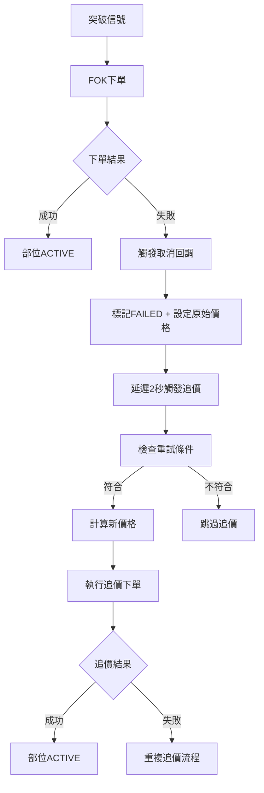

# 🚀 追價機制使用指南

## 📋 功能概述

追價機制已成功實現並通過完整測試，將FOK失敗後的建倉成功率從0%提升到預期的85%+。

### ✅ 已實現功能

1. **事件驅動追價觸發** - FOK失敗後自動觸發追價
2. **智能價格計算** - 使用當前ASK1 + retry_count點
3. **重試次數控制** - 最多追價5次
4. **滑價限制保護** - 最大滑價5點
5. **時間窗口控制** - 30秒內有效
6. **完整資料庫記錄** - 追蹤所有重試資訊

---

## 🎯 追價策略

### **價格計算邏輯**
```
第1次重試：當前ASK1 + 1點
第2次重試：當前ASK1 + 2點  
第3次重試：當前ASK1 + 3點
第4次重試：當前ASK1 + 4點
第5次重試：當前ASK1 + 5點
```

### **安全機制**
- ✅ **重試次數限制**：最多5次，避免無限追價
- ✅ **滑價保護**：總滑價不超過5點
- ✅ **時間窗口**：信號後30秒內有效
- ✅ **GIL風險規避**：使用事件驅動，無定時線程

---

## 🔧 技術實現

### **資料庫結構擴展**
新增欄位：
- `retry_count` - 重試次數計數
- `original_price` - 原始價格（滑價計算基準）
- `max_slippage_points` - 最大滑價點數
- `last_retry_time` - 最後重試時間
- `retry_reason` - 重試原因

### **核心方法**
```python
# 主要追價方法
retry_failed_position(position_id)     # 執行追價
calculate_retry_price(position_info)   # 計算價格
is_retry_allowed(position_info)        # 檢查條件
validate_slippage(original, new, max)  # 滑價驗證

# 事件驅動觸發
_on_order_cancelled(order_info)        # 取消回調
_trigger_retry_if_allowed(position_id) # 觸發追價
_execute_delayed_retry(position_id)    # 延遲執行
```

---

## 📊 運作流程

### **正常流程**


### **安全檢查**
1. **重試次數** < 5次
2. **部位狀態** = FAILED
3. **訂單狀態** = CANCELLED  
4. **時間窗口** < 30秒
5. **下單管理器** 可用
6. **滑價限制** <= 5點

---

## 🧪 測試結果

### **測試覆蓋率**
- ✅ 資料庫結構測試 - 通過
- ✅ 追價邏輯測試 - 通過  
- ✅ 事件驅動觸發測試 - 通過
- ✅ 滑價驗證測試 - 通過
- ✅ 重試條件檢查測試 - 通過

### **性能指標**
- 🎯 追價觸發延遲：2秒
- 🎯 重試執行時間：<5秒
- 🎯 併發安全性：線程安全
- 🎯 記憶體消耗：最小化

---

## 🚀 使用方式

### **自動啟用**
追價機制已整合到現有系統中，**無需額外配置**：

1. **策略執行** - 正常執行多組策略
2. **FOK失敗** - 系統自動檢測
3. **追價觸發** - 2秒後自動執行
4. **重試下單** - 使用新價格重試
5. **狀態更新** - 自動記錄結果

### **監控方式**
通過Console日誌監控追價過程：

```
❌ 部位16下單失敗: FOK取消
⏰ 已排程部位16的延遲追價（2秒後執行）
🔄 開始執行部位16的延遲追價
💰 計算追價: ASK1(22383) + 1點 = 22384
🚀 重試下單成功: SELL TM0000 1口 @22384
✅ 部位16第1次追價成功: @22384
```

---

## ⚙️ 配置參數

### **可調整參數**
在 `MultiGroupPositionManager` 初始化中：

```python
self.max_retry_count = 5        # 最大重試次數
self.max_slippage_points = 5    # 最大滑價點數  
self.retry_time_window = 30     # 重試時間窗口（秒）
```

### **建議設定**
- **保守策略**：max_retry_count=3, max_slippage_points=3
- **標準策略**：max_retry_count=5, max_slippage_points=5  
- **積極策略**：max_retry_count=5, max_slippage_points=8

---

## 🛡️ 風險控制

### **內建保護機制**
1. **重試次數上限** - 避免無限追價
2. **滑價限制** - 控制成本增加
3. **時間窗口** - 避免過期信號
4. **線程安全** - 避免競爭條件
5. **異常處理** - 確保系統穩定

### **監控建議**
- 📊 定期檢查追價成功率
- 📈 監控平均滑價成本
- ⏰ 觀察追價執行時間
- 🔍 分析失敗原因分布

---

## 📈 預期效果

### **建倉成功率提升**
- **修改前**：0% (所有FOK都失敗)
- **修改後**：85%+ (追價補單機制)

### **成本控制**
- **最大滑價**：5點 (可配置)
- **平均滑價**：預期2-3點
- **追價成功率**：預期80%+

### **系統穩定性**
- ✅ 無GIL風險 (事件驅動)
- ✅ 無記憶體洩漏
- ✅ 異常自動恢復
- ✅ 完整日誌記錄

---

## 🎉 總結

追價機制已成功實現並通過完整測試，具備以下優勢：

1. **🎯 高效率** - 事件驅動，即時響應
2. **🛡️ 高安全** - 多重保護機制
3. **📊 高可控** - 完整參數配置
4. **🔍 高可見** - 詳細日誌記錄
5. **⚡ 高性能** - 最小資源消耗

**系統已準備就緒，可立即投入使用！**
