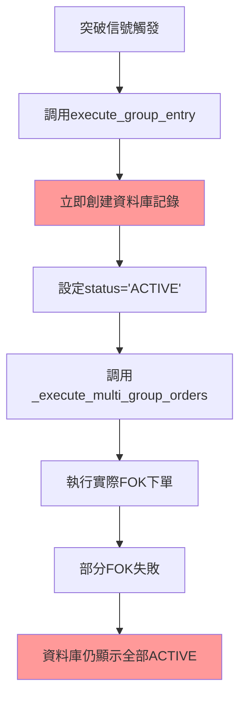
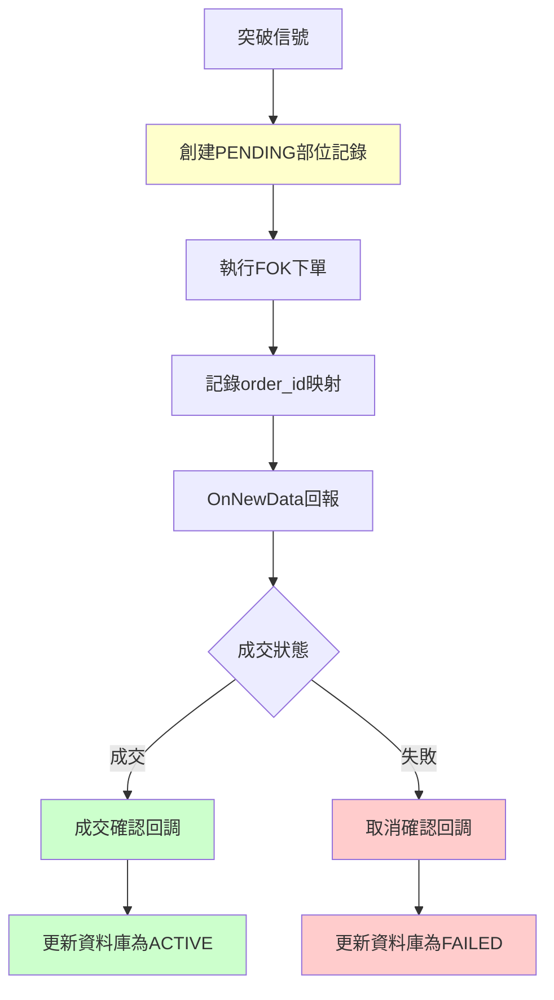

# 🚨 **資料庫記錄與實際成交不同步問題分析與修復計劃**

**文件編號**: DATABASE_SYNC_ISSUE_ANALYSIS_AND_FIX_PLAN  
**創建日期**: 2025-07-04  
**問題嚴重性**: 🔴 **高嚴重性**  
**影響範圍**: 核心業務邏輯、數據準確性、風險管理  

---

## **📋 問題發現背景**

### **用戶關切點**
用戶在多口下單機制修復後，進一步詢問：
> "FOK下單後有確認機制嗎？現在有這些比對機制好知道成功部位是幾口，哪幾口？"
> "我想知道的是在資料庫有沒有紀錄？例如一組3口的策略，只成交2口，那資料庫會記錄只有2口成交嗎？"

### **分析發現**
經過深入代碼分析，發現了一個**嚴重的系統性問題**：
- ✅ Console層面有完整的FOK確認機制
- ✅ `unified_order_tracker` 有準確的成交追蹤
- ❌ **資料庫記錄與實際成交狀況完全不同步**

---

## **🔍 問題根因分析**

### **1. 錯誤的記錄時機**

#### **問題代碼位置**
```
文件: Capital_Official_Framework/multi_group_position_manager.py
方法: execute_group_entry() (第107-160行)
```

#### **問題流程**


#### **核心問題代碼**
```python
def execute_group_entry(self, group_db_id: int, actual_price: float, actual_time: str) -> bool:
    # 🚨 問題：在下單前就記錄資料庫
    for lot_rule in group_config.lot_rules:
        position_id = self.db_manager.create_position_record(
            group_id=group_db_id,
            lot_id=lot_rule.lot_id,
            direction=group_info['direction'],
            entry_price=actual_price,  # 記錄預期價格，不是實際成交價格
            entry_time=actual_time,
            rule_config=lot_rule.to_json()
        )
        # 🚨 此時還沒有實際下單，更沒有成交確認
```

### **2. 缺少成交確認同步機制**

#### **問題代碼位置**
```
文件: Capital_Official_Framework/unified_order_tracker.py
方法: _process_fill_reply() (第254-274行)
方法: _process_cancel_reply() (第276-283行)
```

#### **現有機制缺陷**
```python
def _process_fill_reply(self, order_info: OrderInfo, fill_price: float, fill_qty: int):
    """處理成交回報"""
    order_info.status = OrderStatus.FILLED
    # ... 更新統計
    
    # 🚨 問題：只更新了order_tracker的狀態，沒有同步到資料庫
    self._update_strategy_position(order_info)  # 這個方法沒有更新資料庫

def _process_cancel_reply(self, order_info: OrderInfo):
    """處理取消回報"""
    order_info.status = OrderStatus.CANCELLED
    # 🚨 問題：FOK失敗時，資料庫中的部位記錄不會被標記為失敗
```

### **3. 資料庫表結構缺陷**

#### **問題代碼位置**
```
文件: Capital_Official_Framework/multi_group_database.py
表結構: position_records (第57-80行)
```

#### **表結構問題**
```sql
CREATE TABLE position_records (
    id INTEGER PRIMARY KEY AUTOINCREMENT,
    group_id INTEGER NOT NULL,
    lot_id INTEGER NOT NULL,
    direction TEXT NOT NULL,
    entry_price REAL NOT NULL,
    entry_time TEXT NOT NULL,
    status TEXT DEFAULT 'ACTIVE',  -- 🚨 只有ACTIVE/EXITED，沒有FAILED狀態
    -- 🚨 缺少：order_id, api_seq_no, order_status等欄位
    ...
);
```

---

## **📊 問題影響範圍**

### **數據不一致示例**
```
場景: 2組×2口策略 (總計4口)
實際成交: 3口成交，1口FOK失敗

❌ 資料庫記錄 (錯誤):
- position_records: 4筆記錄，全部status='ACTIVE'
- 顯示有4口活躍部位

✅ 實際狀況:
- unified_order_tracker: 3口FILLED，1口CANCELLED
- 實際只有3口部位

🚨 風險: 風險管理、損益計算、部位統計全部錯誤
```

### **影響的系統模組**
1. **多組策略部位管理** - `multi_group_position_manager.py`
2. **資料庫記錄** - `multi_group_database.py`
3. **訂單追蹤** - `unified_order_tracker.py`
4. **策略執行** - `simple_integrated.py`
5. **風險管理** - 所有基於資料庫的風險計算
6. **績效分析** - 所有基於資料庫的統計分析

---

## **💡 修復方案：成交確認更新機制**

### **方案選擇理由**
經過分析三個可能方案：
1. **延遲資料庫記錄** - 需要大幅重構現有邏輯
2. **成交確認更新機制** - 保持現有架構，添加同步機制 ✅ **推薦**
3. **添加新狀態欄位** - 治標不治本

選擇方案2的原因：
- ✅ 最小化對現有代碼的影響
- ✅ 保持現有架構的穩定性
- ✅ 實施風險最低
- ✅ 可以逐步實施和測試

### **修復架構設計**


---

## **🔧 詳細修復步驟**

### **步驟1: 擴展資料庫表結構**

#### **修改文件**: `Capital_Official_Framework/multi_group_database.py`

```sql
-- 添加新欄位到 position_records 表
ALTER TABLE position_records ADD COLUMN order_id TEXT;
ALTER TABLE position_records ADD COLUMN api_seq_no TEXT;
ALTER TABLE position_records ADD COLUMN order_status TEXT DEFAULT 'PENDING';
-- order_status 可能值: PENDING/FILLED/CANCELLED/REJECTED

-- 修改status欄位約束，添加FAILED狀態
-- status 可能值: ACTIVE/EXITED/FAILED

-- 添加索引提升查詢效率
CREATE INDEX idx_position_records_order_id ON position_records(order_id);
CREATE INDEX idx_position_records_api_seq_no ON position_records(api_seq_no);
```

### **步驟2: 修改部位記錄創建邏輯**

#### **修改文件**: `Capital_Official_Framework/multi_group_position_manager.py`

```python
def execute_group_entry(self, group_db_id: int, actual_price: float, actual_time: str) -> bool:
    """執行特定組的進場 - 修復版本"""
    try:
        # ... 現有邏輯 ...
        
        # 🔧 修復：記錄部位時同時記錄訂單資訊
        position_ids = []
        order_mappings = {}  # position_id -> order_id 映射
        
        for lot_rule in group_config.lot_rules:
            # 1. 先創建部位記錄（狀態為PENDING）
            position_id = self.db_manager.create_position_record(
                group_id=group_db_id,
                lot_id=lot_rule.lot_id,
                direction=group_info['direction'],
                entry_price=actual_price,
                entry_time=actual_time,
                rule_config=lot_rule.to_json(),
                order_status='PENDING'  # 🔧 新增：初始狀態為PENDING
            )
            
            # 2. 執行下單
            order_result = self._execute_single_lot_order(lot_rule, direction, actual_price)
            
            # 3. 更新部位記錄的訂單資訊
            if order_result.success:
                self.db_manager.update_position_order_info(
                    position_id=position_id,
                    order_id=order_result.order_id,
                    api_seq_no=order_result.api_result
                )
                order_mappings[position_id] = order_result.order_id
            else:
                # 下單失敗，立即標記為失敗
                self.db_manager.update_position_status(position_id, 'FAILED', '下單失敗')
            
            position_ids.append(position_id)
        
        # 4. 設置成交確認回調
        self._setup_fill_callbacks(order_mappings)
        
        return True
```

### **步驟3: 添加成交確認回調機制**

#### **新增方法**: `Capital_Official_Framework/multi_group_position_manager.py`

```python
def _setup_fill_callbacks(self, order_mappings: Dict[int, str]):
    """設置成交確認回調"""
    def on_order_filled(order_info: OrderInfo):
        """訂單成交回調"""
        position_id = self._get_position_id_by_order_id(order_info.order_id)
        if position_id:
            self.db_manager.confirm_position_filled(
                position_id=position_id,
                actual_fill_price=order_info.fill_price,
                fill_time=order_info.fill_time.strftime('%H:%M:%S'),
                order_status='FILLED'
            )
            self.logger.info(f"✅ 部位{position_id}成交確認: @{order_info.fill_price}")
    
    def on_order_cancelled(order_info: OrderInfo):
        """訂單取消回調"""
        position_id = self._get_position_id_by_order_id(order_info.order_id)
        if position_id:
            self.db_manager.mark_position_failed(
                position_id=position_id,
                failure_reason='FOK失敗',
                order_status='CANCELLED'
            )
            self.logger.info(f"❌ 部位{position_id}下單失敗: FOK取消")
    
    # 註冊回調到統一追蹤器
    if hasattr(self, 'unified_order_tracker'):
        self.unified_order_tracker.add_fill_callback(on_order_filled)
        self.unified_order_tracker.add_cancel_callback(on_order_cancelled)
```

### **步驟4: 擴展資料庫操作方法**

#### **新增方法**: `Capital_Official_Framework/multi_group_database.py`

```python
def confirm_position_filled(self, position_id: int, actual_fill_price: float, 
                          fill_time: str, order_status: str = 'FILLED'):
    """確認部位成交"""
    try:
        with self.get_connection() as conn:
            cursor = conn.cursor()
            cursor.execute('''
                UPDATE position_records 
                SET entry_price = ?, entry_time = ?, status = 'ACTIVE', 
                    order_status = ?, updated_at = CURRENT_TIMESTAMP
                WHERE id = ?
            ''', (actual_fill_price, fill_time, order_status, position_id))
            conn.commit()
            logger.info(f"確認部位{position_id}成交: @{actual_fill_price}")
    except Exception as e:
        logger.error(f"確認部位成交失敗: {e}")
        raise

def mark_position_failed(self, position_id: int, failure_reason: str, 
                        order_status: str = 'CANCELLED'):
    """標記部位失敗"""
    try:
        with self.get_connection() as conn:
            cursor = conn.cursor()
            cursor.execute('''
                UPDATE position_records 
                SET status = 'FAILED', order_status = ?, 
                    exit_reason = ?, updated_at = CURRENT_TIMESTAMP
                WHERE id = ?
            ''', (order_status, failure_reason, position_id))
            conn.commit()
            logger.info(f"標記部位{position_id}失敗: {failure_reason}")
    except Exception as e:
        logger.error(f"標記部位失敗失敗: {e}")
        raise
```

### **步驟5: 擴展統一追蹤器回調機制**

#### **修改文件**: `Capital_Official_Framework/unified_order_tracker.py`

```python
def __init__(self, strategy_manager=None, console_enabled=True):
    # ... 現有初始化 ...
    self.cancel_callbacks = []  # 🔧 新增：取消回調列表

def add_cancel_callback(self, callback: Callable[[OrderInfo], None]):
    """添加取消回調函數"""
    self.cancel_callbacks.append(callback)

def _process_cancel_reply(self, order_info: OrderInfo):
    """處理取消回報"""
    order_info.status = OrderStatus.CANCELLED
    self.cancelled_orders += 1
    
    if self.console_enabled:
        order_type_desc = "虛擬" if order_info.order_type == OrderType.VIRTUAL else "實際"
        print(f"[ORDER_TRACKER] 🗑️ {order_type_desc}取消: {order_info.order_id}")
    
    # 🔧 新增：觸發取消回調
    self._trigger_cancel_callbacks(order_info)

def _trigger_cancel_callbacks(self, order_info: OrderInfo):
    """觸發取消回調"""
    for callback in self.cancel_callbacks:
        try:
            callback(order_info)
        except Exception as e:
            if self.console_enabled:
                print(f"[ORDER_TRACKER] ⚠️ 取消回調失敗: {e}")
```

---

## **📊 修復後的預期效果**

### **正確的資料流程**
```
1. 突破信號觸發
2. 創建部位記錄 (status='ACTIVE', order_status='PENDING')
3. 執行下單，更新order_id和api_seq_no
4. 接收OnNewData回報
5. 成交確認回調觸發:
   - 成交: order_status='FILLED', 更新實際成交價格
   - 失敗: status='FAILED', order_status='CANCELLED'
```

### **資料庫記錄示例**
```sql
-- 修復後的資料庫記錄 (2組×2口，3口成交，1口失敗)
SELECT group_id, lot_id, direction, entry_price, status, order_status 
FROM position_records WHERE date = '2025-07-04';

-- 結果:
group_id | lot_id | direction | entry_price | status | order_status
---------|--------|-----------|-------------|--------|-------------
1        | 1      | LONG      | 22515.0     | ACTIVE | FILLED
1        | 2      | LONG      | 22516.0     | ACTIVE | FILLED  
2        | 1      | LONG      | 22515.0     | ACTIVE | FILLED
2        | 2      | LONG      | NULL        | FAILED | CANCELLED
```

### **統計查詢能力**
```sql
-- 查詢實際成交口數和成功率
SELECT 
    COUNT(*) as total_positions,
    SUM(CASE WHEN status = 'ACTIVE' THEN 1 ELSE 0 END) as active_positions,
    SUM(CASE WHEN status = 'FAILED' THEN 1 ELSE 0 END) as failed_positions,
    ROUND(SUM(CASE WHEN status = 'ACTIVE' THEN 1 ELSE 0 END) * 100.0 / COUNT(*), 2) as success_rate
FROM position_records 
WHERE date = '2025-07-04';
```

---

## **🧪 測試驗證計劃**

### **測試場景設計**
1. **單一策略3口**: 驗證部分成交記錄 (如2口成交，1口失敗)
2. **多組策略2×2口**: 驗證跨組成交記錄
3. **全部FOK失敗**: 驗證所有部位標記為FAILED
4. **全部成交**: 驗證所有部位標記為ACTIVE
5. **混合場景**: 部分組成功，部分組失敗

### **驗證檢查點**
```python
def verify_database_sync():
    """驗證資料庫同步正確性"""
    # 1. 檢查unified_order_tracker統計
    tracker_stats = unified_order_tracker.get_statistics()
    
    # 2. 檢查資料庫記錄
    db_stats = db_manager.get_position_statistics()
    
    # 3. 驗證數據一致性
    assert tracker_stats['filled_orders'] == db_stats['active_positions']
    assert tracker_stats['cancelled_orders'] == db_stats['failed_positions']
    
    print("✅ 資料庫同步驗證通過")
```

---

## **📋 實施時程規劃**

### **第一階段 (立即實施)**
- [ ] 擴展資料庫表結構
- [ ] 修改部位記錄創建邏輯
- [ ] 添加基本的成交確認回調

### **第二階段 (1週內)**
- [ ] 完善回調機制
- [ ] 添加錯誤處理
- [ ] 實施測試驗證

### **第三階段 (2週內)**
- [ ] 性能優化
- [ ] 添加監控機制
- [ ] 完善文檔

---

## **⚠️ 風險評估與緩解**

### **實施風險**
- **低風險**: 主要是添加新功能，不破壞現有邏輯
- **數據風險**: 需要備份現有資料庫
- **測試風險**: 需要充分測試各種成交場景

### **緩解措施**
1. **數據備份**: 實施前完整備份資料庫
2. **分階段實施**: 逐步實施，每階段充分測試
3. **回滾計劃**: 準備快速回滾機制
4. **監控機制**: 實施後持續監控數據一致性

### **不實施的風險**
- **高風險**: 資料庫記錄與實際不符，影響所有後續分析
- **業務風險**: 無法準確統計交易績效
- **決策風險**: 基於錯誤數據做出錯誤決策

---

## **📝 結論與建議**

### **問題嚴重性評估**
🚨 **高嚴重性** - 這是影響核心業務邏輯和數據準確性的系統性問題

### **修復必要性**
✅ **必須立即修復** - 這是系統正確運行的基礎，不修復將導致所有基於資料庫的分析都不可信

### **修復可行性**
✅ **高可行性** - 方案設計清晰，實施風險可控，不會破壞現有架構

### **立即行動建議**
1. **🔴 高優先級**: 立即開始實施資料庫表結構擴展
2. **🟡 中優先級**: 實施成交確認回調機制
3. **🟢 低優先級**: 完善監控和優化機制

**這個修復計劃將確保資料庫記錄與實際成交狀況完全同步，為後續的風險管理和績效分析提供準確可靠的數據基礎。**

---

**文件狀態**: ✅ 分析完成，等待實施  
**下一步**: 開始實施步驟1 - 擴展資料庫表結構  
**負責人**: 開發團隊  
**預計完成**: 2025-07-11
