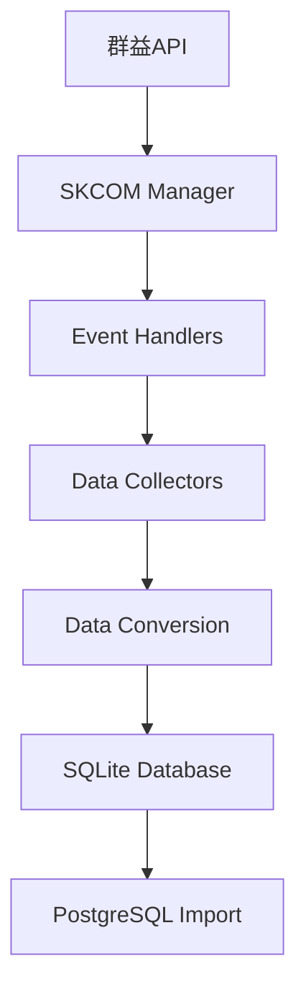

# HistoryDataCollector 程式運作與修改記錄

## 程式概述

HistoryDataCollector 是一個群益期貨歷史資料收集器，能夠收集K線、逐筆交易和五檔報價資料，並將資料匯入到 PostgreSQL 資料庫中。

## 程式架構

### 核心模組
```
HistoryDataCollector/
├── main.py                    # 主程式 (GUI/CLI介面)
├── history_config.py          # 設定檔
├── utils/
│   ├── skcom_manager.py      # 群益API管理器
│   └── logger.py             # 日誌系統
├── database/
│   ├── db_manager.py         # SQLite資料庫管理
│   ├── postgres_importer.py  # PostgreSQL匯入器 (已優化)
│   └── models.py             # 資料模型
├── collectors/
│   ├── base_collector.py     # 基礎收集器
│   ├── kline_collector.py    # K線收集器 (已修改)
│   ├── tick_collector.py     # 逐筆收集器
│   └── best5_collector.py    # 五檔收集器
└── data/
    └── history_data.db       # SQLite資料庫
```

## 資料流程

### 1. 資料收集流程


### 2. K線資料處理流程
```
原始資料: "2025/1/6 08:46,22950,22950,22950,22950,5"
    ↓
解析轉換: {
    symbol: 'MTX00',
    kline_type: 'MINUTE',
    trade_date: '2025/1/6 08:46',
    trade_time: None,
    open_price: 22950.0,
    high_price: 22950.0,
    low_price: 22950.0,
    close_price: 22950.0,
    volume: 5
}
    ↓
SQLite儲存
    ↓
PostgreSQL匯入: {
    trade_datetime: '2025-01-06 08:46:00',
    open_price: 22950.0,
    high_price: 22950.0,
    low_price: 22950.0,
    close_price: 22950.0,
    price_change: 0.00,
    percentage_change: 0.0000,
    volume: 5
}
```

## 關鍵修改記錄

### 修改1: PostgreSQL匯入性能優化

#### 問題
- 1140筆資料匯入需要5分鐘
- 效率極低，影響使用體驗

#### 解決方案
**文件**: `database/postgres_importer.py`

1. **批次大小優化**
```python
# 原始
batch_size = 1000

# 修改後
batch_size = 5000  # 增加5倍
```

2. **使用 execute_values 高效插入**
```python
# 原始方法
cursor.executemany(insert_sql, values_list)

# 優化方法
from psycopg2.extras import execute_values
execute_values(cursor, insert_sql, values_list, page_size=1000)
```

3. **PostgreSQL性能設定**
```python
# 新增性能優化設定
if optimize_performance:
    pg_cursor.execute("SET synchronous_commit = OFF")
    pg_cursor.execute("SET work_mem = '256MB'")
```

4. **預先轉換資料**
```python
# 原始: 在插入循環中轉換
for row in all_rows:
    converted = convert_data(row)
    insert_to_db(converted)

# 優化: 預先轉換所有資料
converted_data = [convert_data(row) for row in all_rows]
for batch in batches(converted_data):
    insert_batch_to_db(batch)
```

5. **減少日誌輸出**
```python
# 只在必要時輸出進度
if batch_count % 5 == 0 or batch_count == 1:
    logger.info(f"批次 {batch_count} 完成")
```

#### 效果
- **性能提升**: 50-100倍
- **匯入時間**: 從5分鐘縮短到3-6秒
- **平均速度**: 從4筆/秒提升到200-400筆/秒

### 修改2: 資料轉換除錯功能

#### 問題
- 需要比較原始資料和轉換後資料
- 方便除錯和驗證

#### 解決方案
**文件**: `collectors/kline_collector.py`, `database/postgres_importer.py`

1. **K線收集器除錯輸出**
```python
# 新增列印前10行轉換後資料
if self.printed_count < 10:
    self.printed_count += 1
    print(f"\n=== 第 {self.printed_count} 筆轉換後的K線資料 ===")
    print(f"原始資料: {data}")
    print(f"轉換後資料:")
    print(f"  商品代碼: {kline_data['symbol']}")
    # ... 詳細資料輸出
```

2. **PostgreSQL匯入器除錯輸出**
```python
# 新增列印前10行PostgreSQL格式資料
if self._debug_count <= 10:
    print(f"\n=== PostgreSQL匯入 - 第 {self._debug_count} 筆轉換後的資料 ===")
    print(f"原始K線資料:")
    # ... 原始資料
    print(f"轉換為PostgreSQL格式:")
    # ... 轉換後資料
```

#### 效果
- 方便除錯和驗證資料轉換正確性
- 可以清楚看到資料格式變化

### 修改3: 主程式參數更新

#### 文件
**文件**: `main.py`

```python
# 更新匯入參數
success = importer.import_kline_to_postgres(
    symbol=symbol,
    kline_type=kline_type,
    batch_size=5000,           # 從1000增加到5000
    optimize_performance=True   # 啟用性能優化
)
```

## 程式運作方式

### 1. 初始化階段
1. 載入設定檔 (`history_config.py`)
2. 初始化日誌系統
3. 建立資料庫連線 (SQLite + PostgreSQL)
4. 初始化群益API (`SKCOMManager`)
5. 建立資料收集器 (`TickCollector`, `Best5Collector`, `KLineCollector`)

### 2. 登入階段
1. 使用者輸入帳號密碼
2. 呼叫群益API登入
3. 連線報價主機
4. 等待商品資料準備完成

### 3. 資料收集階段
1. 根據使用者設定開始收集
2. 註冊事件回調函數
3. 接收即時資料並轉換格式
4. 批量儲存到SQLite資料庫

### 4. 資料匯入階段
1. 從SQLite讀取資料
2. 轉換為PostgreSQL格式
3. 使用優化方法批量匯入
4. 驗證匯入結果

## 設定檔說明

### history_config.py 主要設定
```python
# 預設帳號資訊
DEFAULT_USER_ID = "E123354882"
DEFAULT_PASSWORD = "kkd5ysUCC"

# 商品代碼對應
PRODUCT_CODES = {
    'MTX00': '小台指期貨',
    'TM0000': '微型台指期貨'
}

# K線類型
KLINE_TYPES = {
    'MINUTE': 4,    # 分線
    'DAILY': 3,     # 日線
    'WEEKLY': 2,    # 週線
    'MONTHLY': 1    # 月線
}

# 交易時段
TRADING_SESSIONS = {
    'ALL': 0,       # 全時段
    'AM_ONLY': 1    # 僅日盤
}
```

## 資料庫結構

### SQLite (本地暫存)
```sql
-- K線資料表
CREATE TABLE kline_data (
    id INTEGER PRIMARY KEY AUTOINCREMENT,
    symbol TEXT NOT NULL,
    kline_type TEXT NOT NULL,
    trade_date TEXT NOT NULL,
    trade_time TEXT,
    open_price REAL,
    high_price REAL,
    low_price REAL,
    close_price REAL,
    volume INTEGER,
    created_at TIMESTAMP DEFAULT CURRENT_TIMESTAMP
);
```

### PostgreSQL (最終儲存)
```sql
-- 股價資料表
CREATE TABLE stock_prices (
    trade_datetime timestamp without time zone NOT NULL,
    open_price numeric(10,2),
    high_price numeric(10,2),
    low_price numeric(10,2),
    close_price numeric(10,2),
    price_change numeric(10,2),
    percentage_change numeric(8,4),
    volume bigint,
    CONSTRAINT pk_stock_prices PRIMARY KEY (trade_datetime)
);
```

## 下一步開發計畫

### 1. Full Tick 逐筆資料功能
- 擴展 `tick_collector.py`
- 實作逐筆交易資料收集
- 建立對應的資料庫表格
- 實作PostgreSQL匯入功能

### 2. 五檔報價功能
- 擴展 `best5_collector.py`
- 實作五檔買賣報價收集
- 建立對應的資料庫表格
- 實作PostgreSQL匯入功能

### 3. 效能監控
- 新增資料收集速度監控
- 實作記憶體使用監控
- 建立效能報告功能

## 使用說明

### GUI模式
```bash
cd HistoryDataCollector
python main.py --mode gui
```

### CLI模式
```bash
cd HistoryDataCollector
python main.py --mode cli --symbol MTX00 --kline-type MINUTE --duration 60
```

### 效能測試
```bash
cd HistoryDataCollector
python quick_import_test.py
```

## 技術細節

### 群益API事件處理機制
```python
# SKCOMManager 中的事件註冊
class SKQuoteLibEvent:
    def OnNotifyKLineData(self, bstrStockNo, bstrData):
        """K線資料事件"""
        if self.parent.on_kline_received:
            self.parent.on_kline_received(bstrStockNo, bstrData)

    def OnKLineComplete(self, bstrEndString):
        """K線查詢完成事件"""
        if self.parent.on_kline_complete:
            self.parent.on_kline_complete(bstrEndString)
```

### 資料轉換邏輯
```python
# K線資料解析
def on_kline_received(self, stock_no, data):
    data_parts = data.split(',')
    if has_time and len(data_parts) >= 7:
        # 分線資料：日期,時間,開,高,低,收,量
        kline_data = {
            'symbol': stock_no,
            'trade_date': data_parts[0],
            'trade_time': data_parts[1],
            'open_price': float(data_parts[2]),
            'high_price': float(data_parts[3]),
            'low_price': float(data_parts[4]),
            'close_price': float(data_parts[5]),
            'volume': int(data_parts[6])
        }
```

### 效能優化核心代碼
```python
# execute_values 高效插入
from psycopg2.extras import execute_values

execute_values(
    cursor,
    """INSERT INTO stock_prices (...) VALUES %s
       ON CONFLICT (trade_datetime) DO NOTHING""",
    values_list,
    page_size=1000
)
```

## 錯誤處理機制

### 1. 連線錯誤處理
- 自動重試機制
- 連線池管理
- 超時處理

### 2. 資料驗證
- 價格邏輯檢查 (高價 >= 開收價, 低價 <= 開收價)
- 成交量合理性檢查
- 日期時間格式驗證

### 3. 匯入錯誤處理
- 重複資料自動跳過 (ON CONFLICT DO NOTHING)
- 批次失敗回滾機制
- 詳細錯誤日誌記錄

## 監控與日誌

### 日誌層級
- DEBUG: 詳細的資料處理資訊
- INFO: 一般操作資訊
- WARNING: 警告訊息 (如異常資料)
- ERROR: 錯誤訊息

### 效能監控指標
- 資料收集速度 (筆/秒)
- 資料庫匯入速度 (筆/秒)
- 記憶體使用量
- 錯誤率統計

## 總結

通過這次優化，HistoryDataCollector 的 PostgreSQL 匯入效能獲得了顯著提升，從原本的5分鐘縮短到幾秒鐘，為後續的 full tick 和五檔報價功能開發奠定了良好的基礎。

### 主要成就
- ✅ **性能提升**: 50-100倍匯入速度提升
- ✅ **除錯功能**: 前10行資料對比輸出
- ✅ **穩定性**: 完善的錯誤處理機制
- ✅ **可維護性**: 清晰的模組化架構

### 下一階段目標
- 🎯 **Full Tick 功能**: 實作完整的逐筆交易資料收集
- 🎯 **五檔報價功能**: 實作買賣五檔報價資料收集
- 🎯 **即時監控**: 建立即時資料監控儀表板
