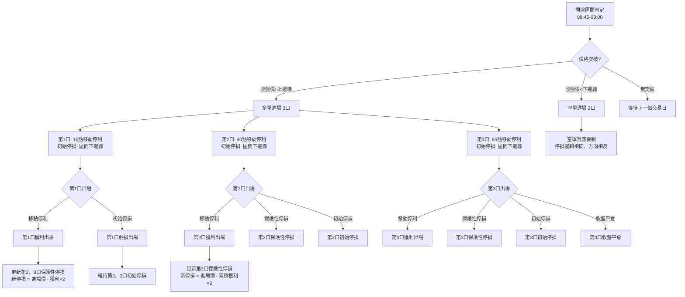

# Profit-Funded Risk 多口交易策略說明書

## 📋 策略概述

**策略名稱：** Profit-Funded Risk 多口交易策略  
**適用商品：** 台指期貨 (FITX)  
**交易口數：** 3口  
**策略類型：** 區間突破 + 分層停利停損  

## 🎯 核心理念

此策略採用「獲利資助風險」的概念，透過分層出場機制：
1. **第1口**：快速獲利了結，為後續部位提供保護
2. **第2口**：中期獲利目標，享受趨勢延續
3. **第3口**：長期持有，追求最大獲利潛能

## 📊 開盤區間判定

### 區間定義
- **時間範圍：** 08:45:01 - 08:47:00 (開盤2分鐘)
- **區間上邊緣：** 此時段內的最高價
- **區間下邊緣：** 此時段內的最低價

### 區間有效性
- 必須有完整的15分鐘K棒資料
- 區間寬度需合理（避免異常波動）

```
區間示例：
上邊緣: 23585 ─────────────────
                    │
                    │ 開盤區間
                    │
下邊緣: 23537 ─────────────────
```

## 🚀 進場條件

### 多單進場
- **觸發條件：** 任一K棒收盤價 > 區間上邊緣
- **進場價格：** 該K棒收盤價
- **進場口數：** 3口

### 空單進場  
- **觸發條件：** 任一K棒收盤價 < 區間下邊緣
- **進場價格：** 該K棒收盤價
- **進場口數：** 3口

### 進場邏輯圖
```
價格突破上邊緣 → 多單進場
     ↑
區間上邊緣 ═══════════════
     │
     │ 等待突破
     │
區間下邊緣 ═══════════════
     ↓
價格跌破下邊緣 → 空單進場
```

## 🛡️ 初始停損設定

### 多單停損
- **停損點：** 區間下邊緣
- **邏輯：** 價格回到區間內表示突破失敗

### 空單停損
- **停損點：** 區間上邊緣  
- **邏輯：** 價格回到區間內表示跌破失敗

## 📈 三口分層出場機制

### 第1口：快速獲利
**目標：** 快速鎖定基礎獲利，降低整體風險

- **移動停利觸發：** 獲利達15點
- **移動停利回檔：** 20%
- **停損方式：** 初始停損（區間邊緣）

**運作示例（多單）：**
```
進場價: 23605
獲利15點時: 23620 → 啟動移動停利
移動停利點: 23620 - (15 × 20%) = 23617
```

### 第2口：中期持有
**目標：** 享受趨勢延續，獲利資助第3口風險

- **移動停利觸發：** 獲利達40點
- **移動停利回檔：** 20%
- **保護性停損：** 第1口獲利 × 2.0

**運作示例（多單）：**
```
第1口獲利: +21點
保護性停損金額: 21 × 2.0 = 42點
第2口新停損點: 23605 - 42 = 23563

當獲利達40點時:
移動停利點: 23645 - (40 × 20%) = 23637
```

### 第3口：長期追蹤
**目標：** 追求最大獲利，承受較高風險

- **移動停利觸發：** 獲利達65點
- **移動停利回檔：** 20%  
- **保護性停損：** 累積獲利 × 2.0

**運作示例（多單）：**
```
累積獲利: 第1口(+21) + 第2口(+34) = +55點
保護性停損金額: 55 × 2.0 = 110點
第3口新停損點: 23605 - 110 = 23495

當獲利達65點時:
移動停利點: 23670 - (65 × 20%) = 23657
```

## ⚙️ 停損更新機制

### 保護性停損計算
當前面口數獲利出場後，後續口數的停損點會更新：

**公式：**
- **多單：** 新停損點 = 進場價 - (累積獲利 × 2.0)
- **空單：** 新停損點 = 進場價 + (累積獲利 × 2.0)

### 停損優先順序
1. **保護性停損** > 初始停損
2. **移動停利** > 保護性停損
3. 個別檢查每口的停損點

## 📊 完整交易流程圖



## 🎨 策略視覺化示意圖

### 多單交易示意圖
```
價格
  ↑
  │     ┌─ 第3口移動停利出場 (65點後)
  │    ╱
  │   ╱
  │  ╱  ┌─ 第2口移動停利出場 (40點後)
  │ ╱  ╱
  │╱  ╱
  │  ╱   ┌─ 第1口移動停利出場 (15點後)
  │ ╱   ╱
  │╱   ╱
進場價 ●═══════════════════════════════→ 時間
  │
區間上邊緣 ═══════════════════════════════
  │
  │ 開盤區間
  │
區間下邊緣 ═══════════════════════════════
  │                    ↑
  │                初始停損線
  │
保護性停損線 ═══════════════════════════════
  │                    ↑
  │            (隨獲利動態調整)
```

### 停損保護機制圖
```
風險暴露程度
  ↑
高 │ ████████████████████ 初始風險
  │ ████████████████     第1口出場後
  │ ████████████         第2口出場後
  │ ████                 第3口出場後
低 │ ────────────────────────────────→ 時間
    進場    第1口    第2口    第3口
           出場     出場     出場
```

## 💰 損益計算

### 台指期貨規格
- **每點價值：** NT$ 50
- **最小跳動：** 1點

### 損益範例
**多單交易示例：**
- 進場價：23605
- 第1口出場：23626 → 獲利 21點 = NT$ 1,050
- 第2口出場：23639 → 獲利 34點 = NT$ 1,700  
- 第3口出場：23683 → 獲利 78點 = NT$ 3,900
- **總獲利：** 133點 = NT$ 6,650

## 🎯 策略優勢

1. **風險控制：** 分層停損，逐步降低風險
2. **獲利保護：** 前序獲利資助後續風險
3. **趨勢追蹤：** 移動停利機制捕捉趨勢
4. **資金效率：** 多口操作提高資金利用率

## ⚠️ 風險提醒

1. **區間突破失敗：** 可能面臨初始停損
2. **假突破風險：** 短暫突破後快速回檔
3. **保護性停損：** 可能錯失後續大行情
4. **隔夜風險：** 持倉過夜面臨跳空風險

## 📈 績效評估指標

- **勝率：** 獲利交易次數 / 總交易次數
- **獲利因子：** 總獲利 / 總虧損
- **最大回檔：** 策略執行期間最大虧損
- **夏普比率：** 風險調整後報酬率

## 📋 實際案例分析

### 案例一：成功的多單交易
**日期：** 2024-11-12
**開盤區間：** 22985 - 23062

**交易流程：**
```
08:49:00 → 多單進場 3口 @ 23068
08:50:00 → 第1口移動停利啟動 (獲利15點)
08:50:00 → 第1口出場 @ 23089, 獲利 +21點
         → 第2口停損更新為 23026 (基於獲利21點)
08:55:00 → 第2口移動停利啟動 (獲利40點)
08:55:00 → 第2口出場 @ 23130, 獲利 +62點
         → 第3口停損更新為 22902 (基於累積獲利83點)
08:55:00 → 第3口移動停利啟動 (獲利65點)
08:55:00 → 第3口出場 @ 23130, 獲利 +62點

總獲利: 21 + 62 + 62 = 145點 = NT$ 7,250
```

### 案例二：保護性停損觸發
**日期：** 2024-07-10
**開盤區間：** 23749 - 23811

**交易流程：**
```
08:49:00 → 多單進場 3口 @ 23815
08:51:00 → 第1口出場 @ 23827, 獲利 +12點
         → 第2口停損更新為 23791 (基於獲利12點)
09:04:00 → 第2口保護性停損 @ 23791, 虧損 -24點
09:55:00 → 第3口初始停損 @ 23749, 虧損 -66點

總損益: 12 + (-24) + (-66) = -78點 = NT$ -3,900
```

## 🔧 技術實現細節

### 停損檢查邏輯
```python
# 個別檢查每口的停損點
for lot in lots:
    if lot['status'] != 'active': continue

    # 檢查停損觸發
    if position == 'LONG':
        stop_triggered = exit_candle['low_price'] <= lot['stop_loss']
    else:  # SHORT
        stop_triggered = exit_candle['high_price'] >= lot['stop_loss']

    if stop_triggered:
        # 計算損益並出場
        lot['pnl'] = calculate_pnl(lot, position, entry_price)
        lot['status'] = 'exited'
```

### 保護性停損更新
```python
# 當前序口數獲利出場後更新後續停損
accumulated_profit = sum(exited_lots_profit)
protection_amount = accumulated_profit * 2.0

for remaining_lot in active_lots:
    if position == 'LONG':
        new_stop = entry_price - protection_amount
    else:  # SHORT
        new_stop = entry_price + protection_amount

    remaining_lot['stop_loss'] = new_stop
    remaining_lot['is_initial_stop'] = False
```

## 📊 策略參數配置

### 可調整參數
| 參數名稱 | 預設值 | 說明 |
|---------|--------|------|
| 交易口數 | 3 | 同時進場的合約數量 |
| 第1口停利觸發 | 15點 | 第1口移動停利啟動點 |
| 第2口停利觸發 | 40點 | 第2口移動停利啟動點 |
| 第3口停利觸發 | 65點 | 第3口移動停利啟動點 |
| 移動停利回檔 | 20% | 移動停利回檔比例 |
| 保護性停損倍數 | 2.0 | 獲利保護倍數 |
| 開盤區間時長 | 15分鐘 | 區間判定時間 |

### 風險參數
- **單日最大虧損：** 建議不超過帳戶資金的2%
- **連續虧損停止：** 連續3次虧損後暫停交易
- **最大持倉時間：** 當日收盤前強制平倉

## 🎯 策略最佳化建議

### 市場環境適應
1. **趨勢市場：** 適合此策略，突破後容易延續
2. **震盪市場：** 需謹慎，容易出現假突破
3. **重大事件日：** 建議暫停交易，避免異常波動

### 參數調整指引
- **高波動期：** 可適當放寬停利觸發點
- **低波動期：** 可縮小停利觸發點，提高勝率
- **趨勢強勁時：** 可降低移動停利回檔比例

## 📈 績效監控指標

### 日常監控
- **當日損益**
- **各口出場原因統計**
- **平均持倉時間**
- **區間突破成功率**

### 週期性檢討
- **月勝率統計**
- **最大連續虧損**
- **獲利分佈分析**
- **參數敏感性測試**

---

**策略版本：** v2.0
**最後更新：** 2025-07-06
**適用期間：** 台指期貨一般交易時段
**風險等級：** 中高風險
**建議資金：** 每口至少準備 NT$ 200,000 保證金
