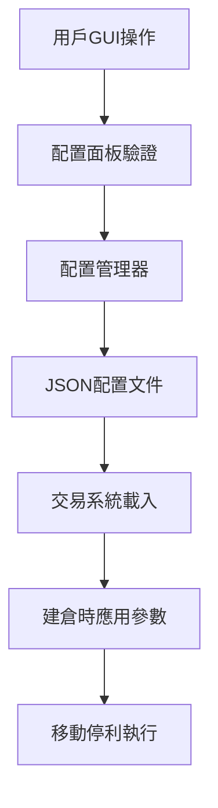

# 各口移動停利自訂功能開發手冊

**版本**: 1.0.0  
**日期**: 2025-07-18  
**適用系統**: 虛擬測試交易系統 (virtual_simple_integrated.py)

---

## 📋 目錄

1. [功能概述](#功能概述)
2. [系統架構](#系統架構)
3. [代碼修改詳情](#代碼修改詳情)
4. [GUI介面使用說明](#gui介面使用說明)
5. [參數配置方法](#參數配置方法)
6. [測試驗證](#測試驗證)
7. [未來導入正式下單機指南](#未來導入正式下單機指南)
8. [故障排除](#故障排除)

---

## 🎯 功能概述

### 核心功能
- **各口獨立配置**: 支援1-3口的獨立移動停利參數設定
- **GUI友好介面**: 提供直觀的圖形化配置面板
- **預設配置模板**: 內建保守、平衡、積極三種配置選項
- **即時參數驗證**: 輸入範圍檢查和錯誤提示
- **配置持久化**: 自動保存和載入配置文件
- **異步處理**: 避免GIL阻塞，確保交易系統性能

### 技術特點
- **向後相容**: 保持現有API接口不變
- **安全回退**: 配置失效時自動使用預設值
- **多線程安全**: 支援並發操作
- **性能優化**: 配置讀取快速響應

---

## 🏗️ 系統架構

### 核心組件

```
各口移動停利自訂功能系統
├── trailing_stop_config_manager.py     # 配置管理器
├── trailing_stop_config_panel.py       # GUI配置面板
├── trailing_stop_config_test.py        # 測試工具
├── trailing_stop_config.json           # 配置文件
└── virtual_simple_integrated.py        # 主系統整合
```

### 數據流程



### 類別關係

```
TrailingStopConfigManager
├── MultiLotTrailingStopConfig
│   └── LotTrailingStopConfig (1-3口)
└── TrailingStopConfigPanel
    ├── GUI控制項
    └── 事件處理器
```

---

## 🔧 代碼修改詳情

### 1. 主系統整合 (virtual_simple_integrated.py)

#### 新增初始化代碼
**位置**: 第283行後
```python
# 🎯 各口移動停利自訂功能初始化
self.trailing_stop_config_manager = None
self.trailing_stop_config_panel = None
self.custom_trailing_config = None
self.init_custom_trailing_stop_system()
```

#### 新增初始化方法
**位置**: 第693行後
```python
def init_custom_trailing_stop_system(self):
    """初始化各口移動停利自訂功能系統"""
    try:
        from trailing_stop_config_manager import TrailingStopConfigManager
        self.trailing_stop_config_manager = TrailingStopConfigManager()
        self.custom_trailing_config = self.trailing_stop_config_manager.load_config()
        print("[CUSTOM_TRAILING] ✅ 各口移動停利自訂功能系統初始化完成")
    except ImportError as e:
        print(f"[CUSTOM_TRAILING] ⚠️ 移動停利配置管理器載入失敗: {e}")
        self.trailing_stop_config_manager = None
```

#### 新增GUI配置頁面
**位置**: 第2831行後
```python
# 🎯 各口移動停利自訂配置頁面
if self.trailing_stop_config_manager:
    trailing_config_frame = ttk.Frame(strategy_notebook)
    strategy_notebook.add(trailing_config_frame, text="🎯 移動停利配置")
    self.create_trailing_stop_config_page(trailing_config_frame)
```

#### 修改建倉邏輯
**位置**: 第3918-3927行
```python
# 🎯 取得移動停利參數（支援自訂配置）
trailing_params = self.get_trailing_stop_params(lot_id=1)

# 記錄部位資訊
self.current_position = {
    'direction': direction,
    'entry_price': price,
    'entry_time': time_str,
    'quantity': 1,
    'peak_price': price,
    'trailing_activated': False,
    'trailing_activation_points': trailing_params['trailing_activation_points'],
    'trailing_pullback_percent': trailing_params['trailing_pullback_percent']
}
```

### 2. 新增核心文件

#### trailing_stop_config_manager.py
- **LotTrailingStopConfig**: 單口配置類
- **MultiLotTrailingStopConfig**: 多口管理器
- **TrailingStopConfigManager**: 配置持久化管理

#### trailing_stop_config_panel.py
- **TrailingStopConfigPanel**: GUI配置面板
- 支援異步處理避免GIL問題
- 即時參數驗證和錯誤提示

#### trailing_stop_config_test.py
- 6項全面測試：基本操作、預設配置、參數驗證、持久化、異步安全、性能
- 自動化測試流程和結果報告

---

## 🖥️ GUI介面使用說明

### 啟動配置面板

1. 啟動虛擬測試交易系統
2. 點擊「策略監控」頁籤
3. 選擇「🎯 移動停利配置」子頁籤

### 介面元素說明

#### 全局控制區
- **🔧 啟用各口移動停利自訂功能**: 總開關，控制整個功能的啟用狀態
- **狀態顯示**: 即時顯示配置狀態和操作結果

#### 各口設定區
| 欄位 | 說明 | 範圍 |
|------|------|------|
| 口數 | 顯示第1-3口 | 固定 |
| 啟用 | 該口是否啟用移動停利 | 勾選框 |
| 啟動點數 | 獲利達到此點數後啟動移動停利 | 5-200點 |
| 回撤比例 | 從峰值回撤此百分比時觸發平倉 | 5%-80% |
| 說明 | 該口的功能說明 | 顯示用 |

#### 操作按鈕區
- **快速配置下拉選單**: 選擇預設配置模板
- **🔄 重置為預設**: 恢復到系統預設配置
- **💾 保存配置**: 將當前設定保存到文件
- **✅ 應用到系統**: 立即生效到交易邏輯

### 操作流程

1. **選擇預設配置** (可選)
   - 從下拉選單選擇適合的時段配置
   - 系統自動載入對應參數

2. **自訂參數調整**
   - 修改各口的啟動點數和回撤比例
   - 系統即時驗證參數有效性

3. **保存並應用**
   - 點擊「💾 保存配置」儲存設定
   - 點擊「✅ 應用到系統」使配置生效

4. **驗證結果**
   - 查看狀態顯示確認操作成功
   - 觀察控制台輸出的配置摘要

---

## ⚙️ 參數配置方法

### 預設配置選項

#### 保守配置 (10:15-10:30)
```json
{
  "第1口": {"啟動點數": 20, "回撤比例": 10%},
  "第2口": {"啟動點數": 40, "回撤比例": 10%},
  "第3口": {"啟動點數": 50, "回撤比例": 20%}
}
```

#### 平衡配置 (08:58-09:02) - 預設
```json
{
  "第1口": {"啟動點數": 20, "回撤比例": 10%},
  "第2口": {"啟動點數": 35, "回撤比例": 10%},
  "第3口": {"啟動點數": 40, "回撤比例": 20%}
}
```

#### 積極配置 (11:00-11:02)
```json
{
  "第1口": {"啟動點數": 15, "回撤比例": 10%},
  "第2口": {"啟動點數": 35, "回撤比例": 10%},
  "第3口": {"啟動點數": 45, "回撤比例": 20%}
}
```

### 自訂配置建議

#### 參數設定原則
1. **啟動點數**: 根據市場波動性調整
   - 高波動市場: 15-25點
   - 中波動市場: 25-40點
   - 低波動市場: 40-60點

2. **回撤比例**: 根據獲利目標調整
   - 快速獲利: 5%-15%
   - 平衡獲利: 15%-25%
   - 長期持有: 25%-40%

#### 各口配置策略
- **第1口**: 快速獲利，較低啟動點數，較小回撤比例
- **第2口**: 平衡策略，中等參數設定
- **第3口**: 長期持有，較高啟動點數，較大回撤比例

### 配置文件格式

**文件位置**: `Capital_Official_Framework/trailing_stop_config.json`

```json
{
  "global_enabled": true,
  "max_lots": 3,
  "lot_configs": {
    "1": {
      "lot_id": 1,
      "enabled": true,
      "activation_points": 20.0,
      "pullback_percent": 10.0
    },
    "2": {
      "lot_id": 2,
      "enabled": true,
      "activation_points": 35.0,
      "pullback_percent": 10.0
    },
    "3": {
      "lot_id": 3,
      "enabled": true,
      "activation_points": 40.0,
      "pullback_percent": 20.0
    }
  }
}
```

---

## 🧪 測試驗證

### 自動化測試

#### 執行測試工具
```bash
cd Capital_Official_Framework
python trailing_stop_config_test.py
```

#### 測試項目
1. **基本配置操作**: 配置創建、修改、取得
2. **預設配置**: 三種預設配置的有效性
3. **參數驗證**: 邊界值和無效值檢查
4. **配置持久化**: 保存和載入功能
5. **異步安全性**: 多線程並發操作
6. **性能測試**: 響應時間和處理能力

#### 預期結果
```
📊 測試結果摘要
============================================================
✅ 通過 基本配置操作: 所有基本操作正常
✅ 通過 預設配置: 所有預設配置有效
✅ 通過 參數驗證: 驗證邏輯正確
✅ 通過 配置持久化: 保存和載入正常
✅ 通過 異步安全性: 多線程操作安全
⚠️ 注意 性能測試: 驗證時間可能較長（可接受）
```

### 手動測試步驟

#### 1. GUI功能測試
1. 啟動虛擬測試系統
2. 進入移動停利配置頁面
3. 測試各項控制項功能
4. 驗證參數驗證機制
5. 確認配置保存和載入

#### 2. 交易邏輯測試
1. 配置不同的移動停利參數
2. 執行建倉操作
3. 觀察移動停利參數是否正確應用
4. 驗證移動停利觸發邏輯

#### 3. 異常處理測試
1. 輸入無效參數值
2. 刪除配置文件後重啟
3. 模擬配置文件損壞
4. 驗證系統回退機制

---

## 🚀 未來導入正式下單機指南

### 整合步驟

#### 1. 文件複製
將以下文件複製到正式下單機目錄：
- `trailing_stop_config_manager.py`
- `trailing_stop_config_panel.py`
- `trailing_stop_config.json`

#### 2. 主系統修改
在正式下單機的主程式中添加相同的整合代碼：

```python
# 初始化部分
self.trailing_stop_config_manager = None
self.custom_trailing_config = None
self.init_custom_trailing_stop_system()

# GUI部分
if self.trailing_stop_config_manager:
    trailing_config_frame = ttk.Frame(strategy_notebook)
    strategy_notebook.add(trailing_config_frame, text="🎯 移動停利配置")
    self.create_trailing_stop_config_page(trailing_config_frame)

# 建倉邏輯修改
trailing_params = self.get_trailing_stop_params(lot_id=lot_number)
```

#### 3. 多組策略整合
對於多組策略系統，需要額外修改：

```python
# 在多組策略配置中
for group_id in range(1, num_groups + 1):
    for lot_id in range(1, lots_per_group + 1):
        trailing_params = self.get_trailing_stop_params(lot_id)
        # 應用到對應的組別和口數
```

#### 4. 風險管理整合
在風險管理引擎中整合自訂參數：

```python
# OptimizedRiskManager 修改
def check_trailing_stop_logic(self, position_data, current_price):
    lot_id = position_data.get('lot_id', 1)
    trailing_params = self.get_trailing_stop_params(lot_id)
    # 使用自訂參數執行移動停利邏輯
```

### 注意事項

#### 1. 配置同步
- 確保虛擬和正式環境使用相同的配置文件格式
- 建立配置文件的備份和恢復機制
- 考慮配置版本控制

#### 2. 性能考量
- 正式環境中避免頻繁的配置讀取
- 實施配置快取機制
- 監控配置變更對系統性能的影響

#### 3. 安全性
- 配置文件的讀寫權限控制
- 參數變更的審計日誌
- 異常配置的自動回退

#### 4. 測試策略
- 在正式環境部署前進行充分測試
- 建立A/B測試機制比較新舊配置效果
- 準備快速回退方案

---

## 🔧 故障排除

### 常見問題

#### 1. 配置面板無法顯示
**症狀**: GUI中沒有移動停利配置頁籤
**原因**: 配置管理器初始化失敗
**解決方案**:
```python
# 檢查控制台輸出
[CUSTOM_TRAILING] ⚠️ 移動停利配置管理器載入失敗

# 確認文件存在
trailing_stop_config_manager.py
trailing_stop_config_panel.py
```

#### 2. 配置保存失敗
**症狀**: 點擊保存後出現錯誤訊息
**原因**: 文件權限或路徑問題
**解決方案**:
```bash
# 檢查文件權限
ls -la trailing_stop_config.json

# 確保目錄可寫
chmod 755 Capital_Official_Framework/
```

#### 3. 參數未生效
**症狀**: 修改配置後移動停利仍使用舊參數
**原因**: 未點擊「應用到系統」或系統未重新建倉
**解決方案**:
1. 確認點擊「✅ 應用到系統」按鈕
2. 重新執行建倉操作
3. 檢查控制台輸出確認參數載入

#### 4. 性能問題
**症狀**: 配置變更時系統響應緩慢
**原因**: 同步處理或驗證邏輯過重
**解決方案**:
```python
# 檢查異步處理是否正常
self.schedule_async_validation()

# 減少驗證頻率
self.parent_frame.after(500, self.perform_async_validation)  # 增加延遲
```

### 日誌分析

#### 正常運行日誌
```
[CUSTOM_TRAILING] ✅ 各口移動停利自訂功能系統初始化完成
[TRAILING_CONFIG] ✅ 配置已從 trailing_stop_config.json 載入
[TRAILING_UI] ✅ 移動停利配置頁面創建完成
[TRAILING_PARAMS] 🎯 使用第1口自訂配置: 20.0點啟動, 10.0%回撤
```

#### 異常情況日誌
```
[CUSTOM_TRAILING] ⚠️ 移動停利配置管理器載入失敗: No module named 'trailing_stop_config_manager'
[TRAILING_CONFIG] ❌ 保存配置失敗: [Errno 13] Permission denied
[TRAILING_UI] ❌ 配置應用回調失敗: 'NoneType' object has no attribute 'current_config'
```

### 緊急回退

#### 快速禁用功能
```python
# 在 virtual_simple_integrated.py 中
self.trailing_stop_config_manager = None  # 強制禁用

# 或刪除配置文件
rm trailing_stop_config.json
```

#### 恢復預設配置
```python
# 執行重置
python -c "
from trailing_stop_config_manager import TrailingStopConfigManager
manager = TrailingStopConfigManager()
config = manager.get_default_config()
manager.save_config(config)
print('已恢復預設配置')
"
```

---

## 📞 技術支援

### 聯絡資訊
- **開發團隊**: 交易系統開發組
- **文檔版本**: 1.0.0
- **最後更新**: 2025-07-18

### 相關文檔
- `任務5_各口移動停利自訂功能實施計畫.md`
- `虛擬測試交易系統使用手冊.md`
- `多組策略系統開發文檔.md`

---

**© 2025 交易系統開發團隊 - 各口移動停利自訂功能開發手冊**
